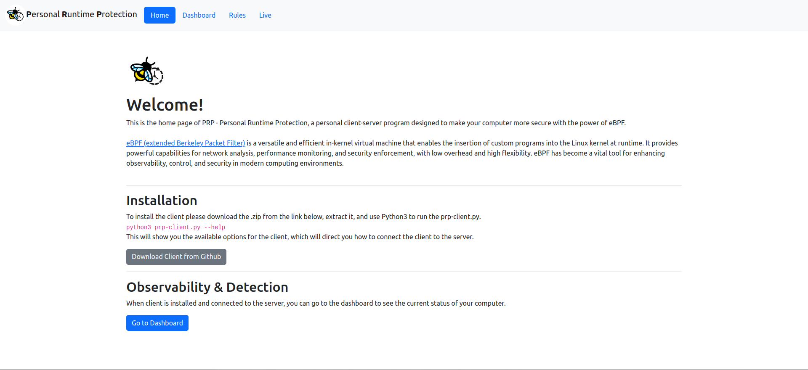

# Personal Runtime Protection

PRP - Personal Runtime Protection, is an open-source, and very basic client-server program that (as I hope) is the start of a big and important
project designed to give your linux based computer the power of runtime protection using eBPF.



## Installation

```sh
pip install -r requirements.txt
cd server/frontend
npm install
```

### Development setup

As a developer feel free to edit & change everything in this project, the project tries to be as configurable as possible, see for example the client/config.json file.

## Contributing

1. Fork it (<https://github.com/idosharon/personal-runtime-protection/fork>)
2. Create your feature branch (`git checkout -b feature/amazing-changes`)
3. Commit your changes (`git commit -am 'Added some magic'`)
4. Push to the branch (`git push origin feature/amazing-changes`)
5. Create a new Pull Request
